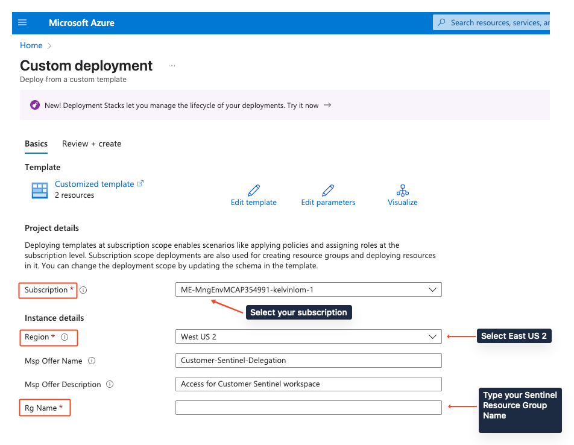
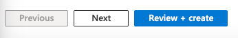
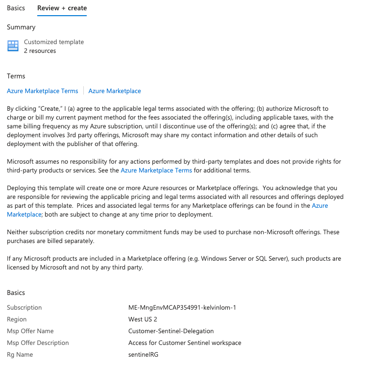

## Onboarding Microsoft Sentinel to Azure Lighthouse Guide

**Click on the following button** to initiate the process:

This will take you to your Azure environment and display our custom template which you must fill out as indicated by the red boxes.

Upon completing the template's form, on the bottom section of this page, you will see the Review + create button. Click on that for the final step.

This will kick off a validation process to see that all the fields are completed. Review the information and when ready, click on the Create button at the bottom of this page.

And you're set. To verify that the Sentinel delegation deployed successfully, see the following steps.

## How to Verify Azure Lighthouse Delegation from the Customer’s Tenant

### 1. Sign in to the Azure Portal

Log in to the Azure portal using an account with sufficient permissions (such as Owner or Contributor) in the customer’s tenant.

### 2. Navigate to Azure Lighthouse Delegations

- In the Azure portal, search for and select **Service providers** from the left-hand menu or the search bar.
    
- You will see two relevant sections under Service providers:
    
    - **Offers**: Displays all service provider offers that have been delegated.
        
    - **Delegations**: Shows all active delegations, including scopes and provider details.
        

### 3. Check Delegated Offers

- Click on **Offers** to view all service provider offers.
    
- Find the offer by its **offer name** (the `mspOfferName` specified in the ARM template).
    
- Review the **scope** (subscription or resource group) associated with each offer.
    

### 4. Review Delegation Details

- Click on **Delegations** to see a comprehensive list of all active delegations.
    
- You can filter or search to find specific delegations by offer name or scope.
    
- Select a delegation to view more details, including the managing service provider and the resources involved.
    

### 5. Confirm Delegation Status

- Ensure the delegation appears as expected with the correct offer name and scope.
    
- If the delegation does not appear immediately, wait up to 15 minutes and refresh the portal.
    

### 6. Additional Actions (Optional)

- If you have sufficient permissions, you can remove or update delegations from this page.
    
- Use Azure Policy or access controls to monitor or restrict delegations as needed.
    

### Quick Reference Table

| Tenant   | Azure Lighthouse Portal Location | What You'll See                     |
| -------- | -------------------------------- | ----------------------------------- |
| Customer | Service providers > Offers       | Delegated offers, offer name, scope |
| Customer | Service providers > Delegations  | List of all delegations, filterable |
| Provider | My customers                     | Delegated subscriptions, offer name |

---

